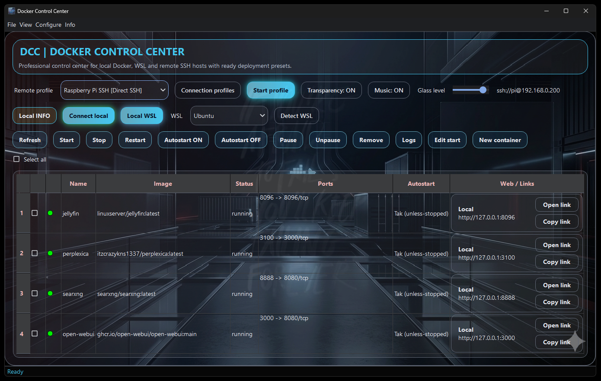
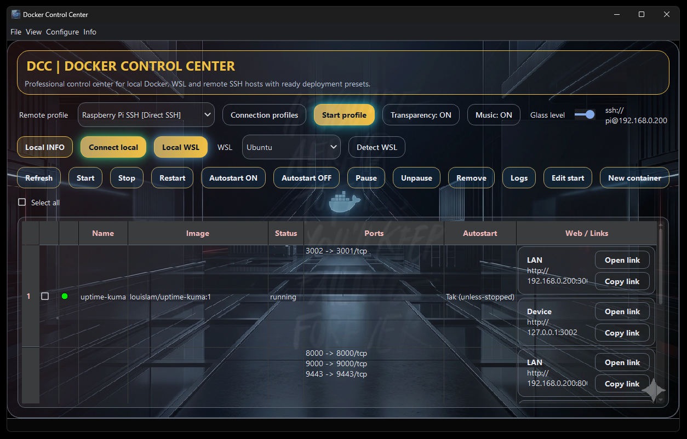
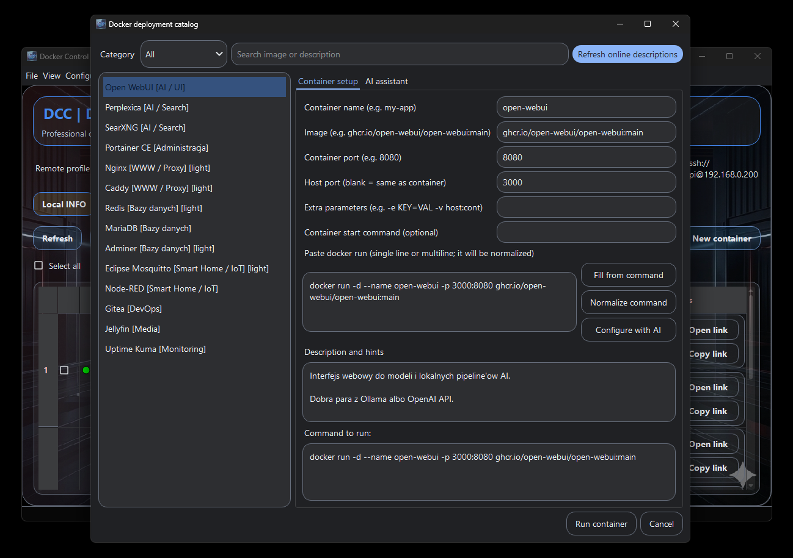
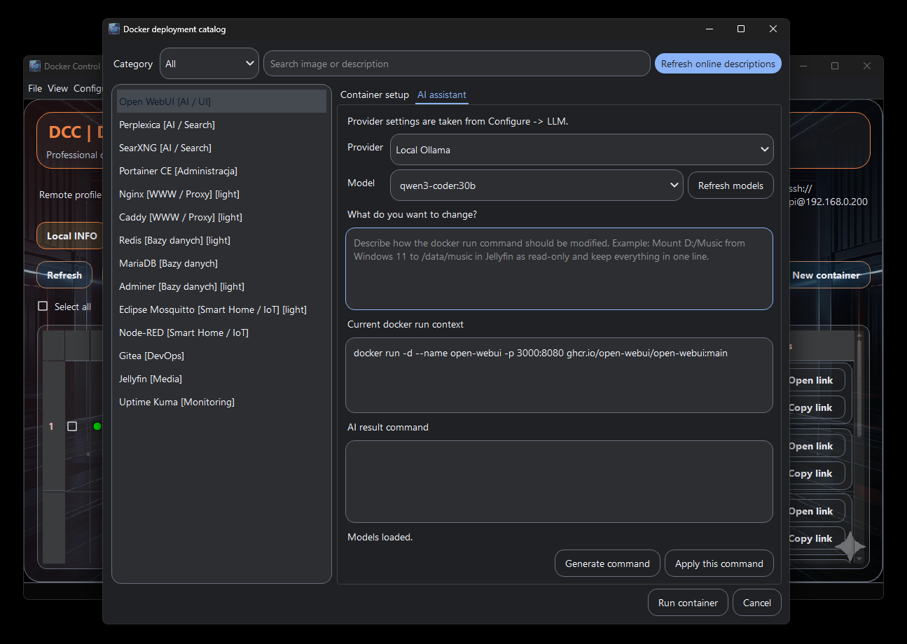
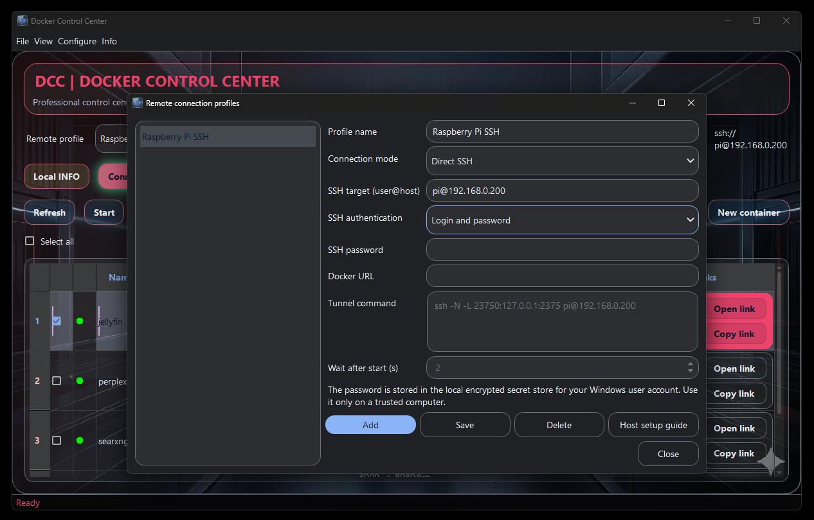

# Docker Control Center

[Jump to Polish / Przejdz do polskiej wersji](#polski)

A cross-platform desktop control panel for managing Docker on Windows and Debian-family Linux, locally, through WSL/WSL2, and on remote hosts over SSH or Balena OS.

### Download Latest Version

## What's New in v1.3.5

### EN
- Added a manual container configuration mode with editable image, ports, parameters, command and full `docker run` input.
- Fixed `Configure -> Edit start` so it shows the actual selected container and preserves its current runtime configuration instead of selecting the first app-store preset.
- Added a central application catalog from `hattimon/DCC`, automatic refresh at startup, extra catalog repositories and cached offline fallback.
- Catalog deployments pull fresh Docker images, while local/private manual images remain untouched.
- Added automated upstream release tracking and a reviewed candidate-discovery workflow for new self-hosted/container applications.
- Expanded Windows + Linux support, dependency setup, SSH profiles/agent support, container resource monitoring, grouping, search and sortable CPU/RAM columns.

### PL
- Dodano ręczną konfigurację kontenera z edycją obrazu, portów, parametrów, komendy i pełnego polecenia `docker run`.
- Poprawiono `Konfiguruj -> Edytuj start`: okno pokazuje rzeczywiście wybrany kontener i zachowuje jego aktualną konfigurację zamiast podstawiać pierwszy preset ze sklepu.
- Dodano centralny katalog aplikacji z `hattimon/DCC`, automatyczne odświeżanie przy starcie, dodatkowe repozytoria katalogów i cache offline.
- Wdrożenia z katalogu pobierają świeży obraz Docker, a ręczne/lokalne obrazy pozostają bez wymuszonego pobierania.
- Dodano automatyczne śledzenie release'ów upstream oraz workflow odkrywający nowe aplikacje jako kandydatów wymagających przeglądu.
- Rozbudowano obsługę Windows + Linux, zależności, profile SSH/ssh-agent, monitoring CPU/RAM, grupowanie, wyszukiwarkę i sortowanie kolumn CPU/RAM.

## English

### What it does
- Manage local Docker containers from one desktop app.
- Connect to WSL / WSL2 Docker environments.
- Connect to remote Docker hosts over SSH or Balena OS (auto-detected).
- Browse container logs, inspect containers, open web links, and manage autostart.
- Create and modify container run commands with presets and AI-assisted editing.
- Switch between `Light`, `Dark`, and `Black` themes with background artwork support.

### Screenshots
Screenshots below use the English UI.

`Main view - local containers`

`Remote view - SSH-connected containers`

`New container wizard`

`AI assistant`

`New remote profile`

### Distribution
- `Installer`: installs for the current Windows user.
- `Portable`: standalone EXE package with no Python requirement.

### SSH key + passphrase
1. Open `Connection profiles` and add/edit a profile.
2. Set `SSH authentication` to `SSH key + passphrase`.
3. Choose the key file and enter the passphrase.
4. Optional: enable ssh-agent in Windows (see the in-app guide).

### Privacy and security
- User settings are stored per Windows user in `%APPDATA%\DockerControlCenter`.
- API keys and SSH passwords are not stored in the repository.
- Secrets are protected per user with Windows DPAPI.
- The public repository excludes personal profiles, secrets, build folders, and local environment files.

### Included features
- Local Docker management
- WSL / WSL2 integration helpers
- SSH profiles with key, passphrase, or password auth
- Balena OS auto-detection (`balena ps` / `balena run`)
- Curated catalog of 50+ popular images, including lightweight Raspberry Pi options
- AI assistant for `docker run` command editing
- Per-theme custom backgrounds
- Music toggle and futuristic desktop UI
- Context actions, logs, inspect, and link opening

### Example user data files
- `docker_connection_profiles.example.json`
- `%APPDATA%\DockerControlCenter\docker_connection_profiles.json`
- `%APPDATA%\DockerControlCenter\docker_control_center_secrets.json`

---

## Polski

### Co robi aplikacja
- Zarzadza lokalnymi kontenerami Docker z jednego okna.
- Laczy sie z Dockerem w WSL / WSL2.
- Laczy sie ze zdalnymi hostami Docker przez SSH lub Balena OS (auto-wykrywanie).
- Pokazuje logi, inspect, linki WWW i pozwala ustawic autostart kontenerow.
- Umozliwia tworzenie i edycje komend `docker run` z presetami oraz wsparciem AI.
- Pozwala przelaczac motywy `Light`, `Dark` i `Black` oraz korzystac z tapet graficznych.

### Zrzuty ekranu
Ponizsze zrzuty pokazuja interfejs w jezyku angielskim.

`Widok glowny - lokalne kontenery`

`Widok zdalny - kontenery przez SSH`

`Kreator nowego kontenera`

`Asystent AI`

`Dodawanie nowego profilu zdalnego`

### Dystrybucja
- `Installer`: instaluje aplikacje dla aktualnego uzytkownika Windows.
- `Portable`: samodzielna wersja EXE bez potrzeby instalacji Pythona.

### Klucz SSH + haslo do klucza
1. Otworz `Profile polaczen` i dodaj/edytuj profil.
2. Ustaw `Autoryzacja SSH` na `Klucz + haslo do klucza`.
3. Wybierz plik klucza i wpisz haslo.
4. Opcjonalnie: wlacz ssh-agent w Windows (instrukcja w aplikacji).

### Prywatnosc i bezpieczenstwo
- Ustawienia uzytkownika sa trzymane per konto Windows w `%APPDATA%\DockerControlCenter`.
- Klucze API i hasla SSH nie sa przechowywane w repozytorium.
- Sekrety sa zabezpieczane przez Windows DPAPI dla konkretnego uzytkownika.
- Publiczne repo nie zawiera prywatnych profili, sekretow, buildow ani lokalnego srodowiska.

### Najwazniejsze funkcje
- Zarzadzanie lokalnym Dockerem
- Wsparcie dla WSL / WSL2
- Profile SSH z kluczem, haslem do klucza lub haslem
- Auto-wykrywanie Balena OS (`balena ps` / `balena run`)
- Katalog 40+ popularnych obrazow, w tym lekkie opcje pod Raspberry Pi
- Asystent AI do edycji komend `docker run`
- Rozne tla dla motywow
- Muzyka w tle i futurystyczny interfejs
- Menu kontekstowe, logi, inspect i otwieranie linkow

### Przykladowe pliki danych
- `docker_connection_profiles.example.json`
- `%APPDATA%\DockerControlCenter\docker_connection_profiles.json`
- `%APPDATA%\DockerControlCenter\docker_control_center_secrets.json`

## Repository contents
- `docker-menager.ps` - main application source
- `DockerControlCenter.nsi` - NSIS installer script
- `backgrounds/` - theme background artwork
- `images/` - README screenshots
- `icon.ico` / `icon.png` - application icons
- `bg.mp3` - optional in-app background music

